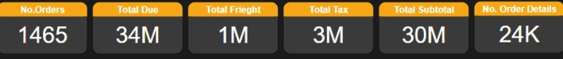
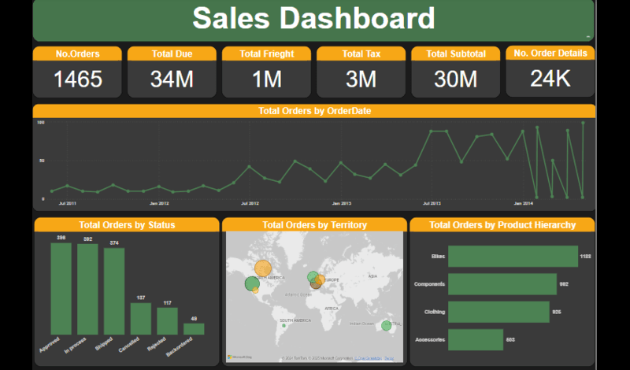
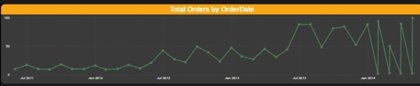
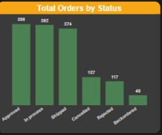
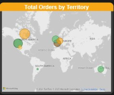
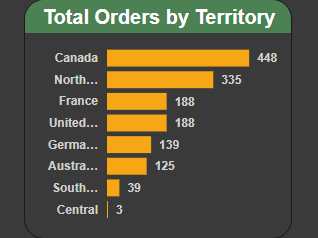
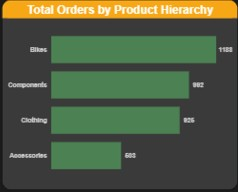
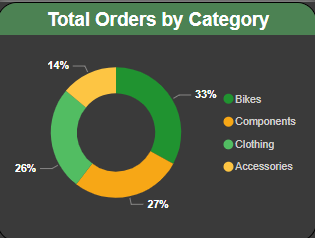

# 📊 Sales Dashboard

# 1. 📝 Overview
The Sales Dashboard provides insights into sales performance through key metrics, visualizations, and interactive tooltips. It includes total orders, financial figures, order trends, and categorical breakdowns.

# 2. 📂 Data Source
📌 **File Used:** Sales.xlsx

📌 **Data Included:** Order details, financial figures, product categories, territories, and sales status.

📌 **Processing Tool:** Power BI

# 3. 📈 Key Performance Indicators (KPIs)
## 🎯 Top Metrics (Displayed at the top bar)

✅ **No. Orders:** Total count of orders.

✅ **Total Due:** Total sales revenue.

✅ **Total Freight:** Shipping costs.

✅ **Total Tax:** Total tax collected.

✅ **Total Subtotal:** Sales revenue before tax and freight.

✅ **No. Order Details:** Count of order line items.

🖼️ 

# 4. 📊 Visualizations
## 🌍 Complete Sales Dashboard

🖼️ 

## 📆 Total Orders by Order Date
📌 **Chart Type:** Line Chart

📌 **Purpose:** To visualize order trends over time.

📌 **Data Used:** Order Date, No. of Orders.

🖼️ 

## 📌 Total Orders by Status
📊 **Chart Type:** Column Chart

📊 **Purpose:** Breakdown of orders by status (Approved, Processing, Canceled, etc.).

📊 **Data Used:** Order Status, No. of Orders.

🖼️ 

## 🗺️ Total Orders by Territory
📍 **Chart Type:** Map and Bar Chart

📍 **Purpose:** Shows distribution of orders across regions.

📍 **Data Used:** Territory, No. of Orders.

🖼️ 

🖼️ 

## 🛒 Total Orders by Product Hierarchy
📦 **Chart Type:** Bar Chart

📦 **Purpose:** Displays product category performance (Bikes, Components, Clothing, Accessories).

📦 **Data Used:** Product Category, No. of Orders.

🖼️ 

## 🏷️ Total Orders by Category
📊 **Chart Type:** Donut Chart

📊 **Purpose:** Displays proportion of sales by product category.

📊 **Data Used:** Product Category, Percentage of Orders.

🖼️ 

# 5. 🖱️ Interactivity
🎯 **Tooltips:** Hovering over elements provides additional insights.

🎯 **Filters:** Can be applied based on date range, category, or region.
# 6. 🔍 Conclusion
🚀 This dashboard enables stakeholders to analyze sales trends, understand regional performance, and optimize sales strategies. Further enhancements can include forecasting and customer segmentation for deeper insights.
